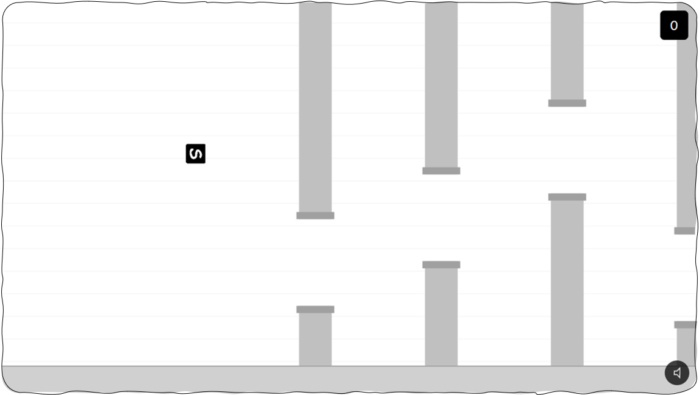

# Flappy

A lightweight, browser-based Flappy Bird clone built with HTML5, CSS, and JavaScript featuring smooth physics and retro arcade gameplay.

Fly through endless obstacles in this web-based `Flappy` game!

[](https://heysanzu.github.io/sanzuFlappy)



---  

```bash
git clone https://github.com/heysanzu/sanzuFlappy.git
cd sanzuFlappy
```
<p align="left">
  
</p>

Maintained by [@heysanzu](https://github.com/heysanzu)
